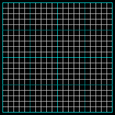
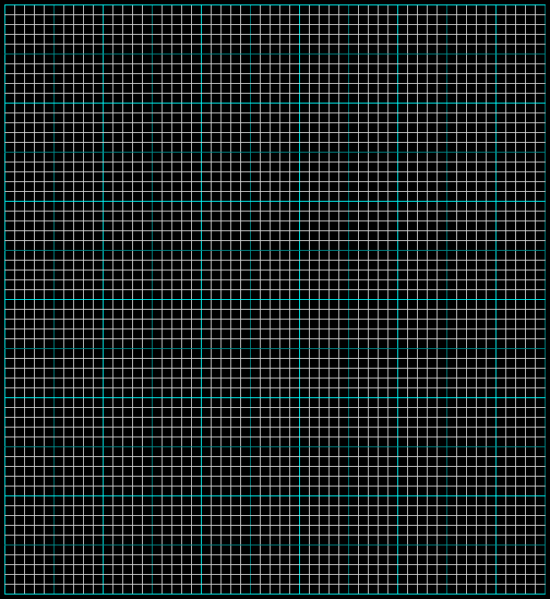

CodeCombatGridmancer
=========

CodeCombatGridmancer is a straightforward _(I hope)_ implementation of a minimum dissection into the rectangles of a rectilinear polygon.

Here are a couple of examples:

This is the initial map that caught my attention and got me interested in this puzzle.  It's based off of a [coding contest](http://codecombat.com/play/level/gridmancer#) that [CodeCombat](http://codecombat.com) put up.  My primary strength is **not** JavaScript, and the interface was acting weird with Chrome, Firefox and MSIE, so I started doing some research on my own, and eventually coded it in C#.

After some various Google searches, I found myself at [this answer on StackOverflow](http://stackoverflow.com/questions/5919298/algorithm-for-finding-the-fewest-rectangles-to-cover-a-set-of-rectangles/6634668#6634668) which gave me the impetus to start working on it seriously.

As you can see, I have a solution that's somewhat different but still meets the same answer size.  I suspect that I'm using a different algorithm to select the wall to connect a resulting concave vertex.

Usage
-----

This is pretty much a standalone program, but it has some configuration capabilities available in the config file.

1. There has to be a text file that contains the map.  The key for it in the config is "mapName" with a fallthrough to "Map.txt".  I've provided a couple of .txt files that can be used for mapping purposes.  Right now, the contents have to be a rectilinear grid with a '#' indicating a section of the polygon.  Any other character is seen as a space.  I've been using '.' for the maps.  Feel free to use your own characters other than '#'.

2. There are multiple output types indicated by the "ouputType" key.  Currently the available ones are:
    * **Text** - This generates a text file with all the rectangles listed as a number between [] and spaces for the holes in the map.
    * **Screen** - This shows you the resulting mapping of rectangles on your console screen.  It's not pretty, but it works.
    * **CodeCombatGridmancer** - This spits out the JavaScript needed to just lay out the tiles for the challenge.

   * **Png** - This is very rough code at this point.  I would love to spend some more time on it, but that's not going to happen any time soon.  There's some documentation in the source code, and a _lot_ of hooks that I want to implement.  The net result is that it will generate a series of PNG files showing each rectangle as it gets placed.

3. There's one other key, and that's "showStatus" that provides running information as pieces get choped up and placed back into the queue for further processing.  That can be turned off by changing the value to "false".

---
Currently, this is configured to output the screen version of the CodeCombat map.